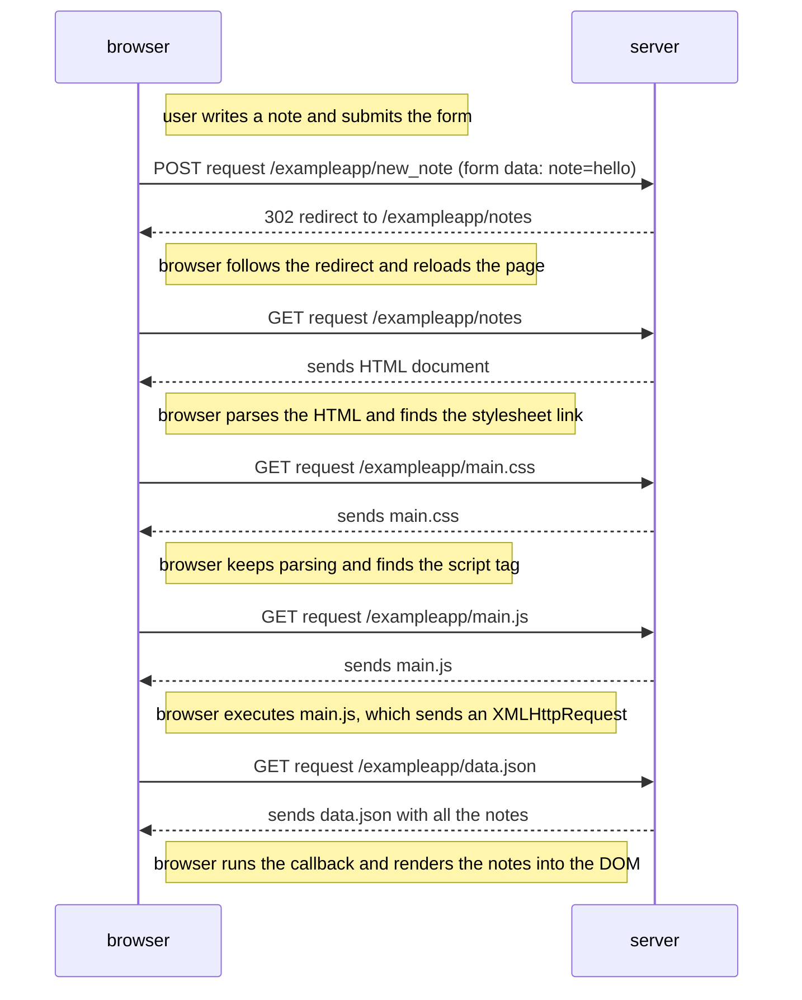

# 0.4: New note diagram

Sequence diagram of the traffic when a user creates a new note on the
*traditional* (non-SPA) version of the example app at `/exampleapp/notes`.

```mermaid
sequenceDiagram
    participant browser
    participant server

    Note right of browser: user writes a note and submits the form

    browser ->> server: POST request /exampleapp/new_note (form data: note=hello)
    server -->> browser: 302 redirect to /exampleapp/notes

    Note right of browser: browser follows the redirect and reloads the page

    browser ->> server: GET request /exampleapp/notes
    server -->> browser: sends HTML document

    Note right of browser: browser parses the HTML and finds the stylesheet link

    browser ->> server: GET request /exampleapp/main.css
    server -->> browser: sends main.css

    Note right of browser: browser keeps parsing and finds the script tag

    browser ->> server: GET request /exampleapp/main.js
    server -->> browser: sends main.js

    Note right of browser: browser executes main.js, which sends an XMLHttpRequest

    browser ->> server: GET request /exampleapp/data.json
    server -->> browser: sends data.json with all the notes

    Note right of browser: browser runs the callback and renders the notes into the DOM
```
